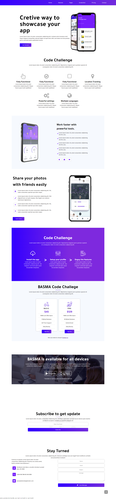

# Code Challenge
a website does not has a lot of functionality but it shows how you can split the component and make it reusable and maintainable.
and it is responsive for mobile devices.

## to run this code on your PC:
 `npm install`, `npm start`

## How this code programmed:

Inside `src` folder you can see three folder:
- `components` : all the components that you can use in the app, there is a lot of things common in this website such as:
  . button
  . cards
  . icons
  . input fields
  . widgets

- `pages` : folder I splited each page like the attached design EX: first page called home,
second page inside second folder with Second component name, third page inside third folder and so on...

  - each folder inside pages folder has 2 file JSX file it is the comonent and CSS file it is the style related to this component.
  
  - Some component has some comments describe some code needs a comment.

- `images`: it has the images and SVG file for icons.

### Note: 
I used fontawesome Icon for the icons with this website. font from google.

